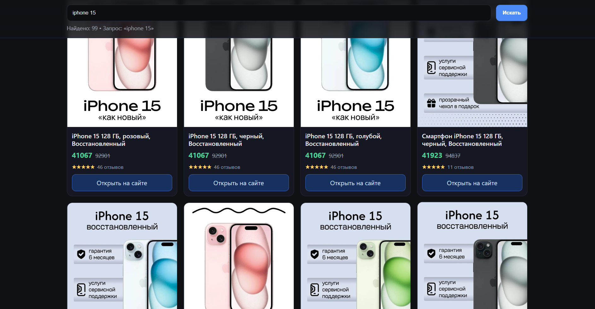

# MarketAgregator

Поисковый агрегатор цен и карточек товаров из Ozon и Wildberries.


**Для чего нужен**
- Быстро сравнивать цены и характеристики товаров между Ozon и Wildberries по одному запросу
- Получать нормализованный ответ с единым набором полей для дальнейшей аналитики
- Снижать нагрузку на источники благодаря кэшированию в Redis


**Архитектура**
- Бэкенд (Go):
  - HTTP API: эндпоинт GET /search?query=… отвечает списком товаров [main.go](./main.go#L189-L208)
  - Кэш: Redis (прозрачно отключается, если недоступен) [main.go](./main.go#L33-L57)
  - Адаптеры источников:
    - Ozon: Composer API + парсинг JSON widgetStates, нормализация цен, отзывов, изображений [ozon_adapter.go](./adapters/ozon/ozon_adapter.go#L116-L209) • [Parse](./adapters/ozon/ozon_adapter.go#L234-L335)
    - Wildberries: официальное search API v18, сбор данных и восстановление ссылки на изображение [wb_adapter.go](./adapters/wb/wb_adapter.go#L123-L262)
  - Модель данных: единый формат товара [item.go](./adapters/models/item.go#L1-L13)
- Фронтенд (React + Vite + TypeScript):
  - Поисковая форма, запрос к /search, клиентская фильтрация и сортировка по цене [App.tsx](./web/src/App.tsx#L54-L71)
  - Карточка товара: изображение, цены, рейтинг/отзывы, ссылка на источник [ProductCard.tsx](./web/src/components/ProductCard.tsx#L37-L69)
  - Точка входа и разметка [main.tsx](./web/src/main.tsx#L1-L6) • [index.html](./web/index.html)


**Поток запроса**
- Фронтенд делает запрос GET /search?query=iphone 15
- Бэкенд нормализует запрос и пробует прочитать кэш из Redis.
- При промахе кэша параллельно опрашиваются адаптеры Ozon и WB.
- Результаты объединяются, сортируются по DiscountPrice, сохраняются в Redis и возвращаются клиенту.


**Формат ответа**
Каждый товар имеет единый набор полей

```json
{
  "product_url": "https://www.ozon.ru/product/…",
  "image_url": "https://…/wc1000/…jpg",
  "product_id": "123456",
  "product_name": "Смартфон …",
  "product_discount_price": "49 990 ₽",
  "product_base_price": "54 990 ₽",
  "product_statistic": "4,8 • 1 234",
  "product_stars": "4,8",
  "product_reviews": "1234"
}
```


**Зависимости**
- Go: см. [go.mod](./go.mod#L1-L12) (redis v8, gjson и др.)
- Redis: локально на localhost:6379 (или другой адрес через переменные окружения)
- Node.js: фронтенд React/Vite/TS [package.json](./web/package.json#L1-L23)
- Прокси: строка в [proxy.txt](./proxy.txt) для доступа к API источников
- Необязательно: Python fallback для Ozon (Chromedriver + BS4) [requirements.txt](./requirements.txt#L1-L4)


**Запуск**
- Подготовить фронтенд:

```bash
cd web
npm install
npm run build
```

- Запустить бэкенд:

```bash
cd ..
go mod download #установит зависимости
go run main.go
# Сервер на :8080, отдаёт статические файлы из web/dist
```

**Переменные окружения**:
  - PORT — порт HTTP (по умолчанию 8080)
  - REDIS_ADDR — адрес Redis (по умолчанию localhost:6379)
  - REDIS_PASSWORD — пароль Redis (если требуется)

**Скриншот работы**



