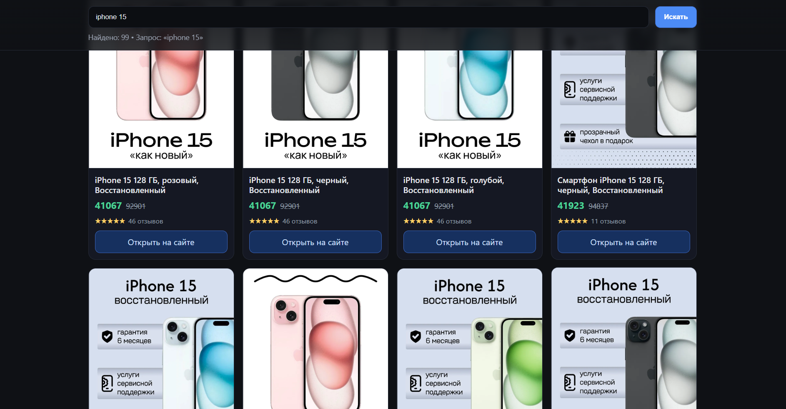

# MarketAgregator

Веб-приложение для поиска и сравнения товаров из Ozon и Wildberries. Сервис
параллельно обращается к маркетплейсам, приводит ответы к единому формату,
сортирует предложения по цене и кэширует результаты в Redis.



## Возможности

- одновременный поиск по Ozon и Wildberries;
- единая модель товара для разных источников;
- сортировка предложений по цене;
- кэширование результатов в Redis на один час;
- продолжение работы без Redis, если он недоступен;
- веб-интерфейс на React и TypeScript;
- отмена внешних запросов по контексту и общий таймаут поиска;
- частичный результат, если один из маркетплейсов временно недоступен.

## Архитектура

Бэкенд написан на Go и разделён на независимые слои:

- [точка входа](./cmd/marketagregator/main.go) — сборка зависимостей и запуск HTTP-сервера;
- [HTTP API](./internal/httpapi/handler.go) — валидация запроса и формирование ответа;
- [сервис поиска](./internal/search/service.go) — кэш, параллельный опрос источников и сортировка;
- [модель товара](./internal/product/item.go) — общий контракт и разбор цены;
- [Redis-кэш](./internal/cache/redis.go);
- адаптеры [Ozon](./internal/marketplace/ozon/client.go) и
  [Wildberries](./internal/marketplace/wb/client.go);
- [React-интерфейс](./web/src/App.tsx) и
  [карточка товара](./web/src/components/ProductCard.tsx).

Поток одного запроса:

1. Клиент вызывает `GET /search?query=iphone%2015`.
2. Сервис нормализует поисковую строку и проверяет Redis.
3. При промахе кэша Ozon и Wildberries опрашиваются параллельно.
4. Успешные ответы объединяются и сортируются по цене.
5. Результат сохраняется в Redis и возвращается клиенту.

Если один источник недоступен, сервис возвращает данные второго. Если завершились
ошибкой все источники, API отвечает `500 Internal Server Error`.

## API

### `GET /search`

Параметры:

| Параметр | Обязательный | Описание |
| --- | --- | --- |
| `query` | да | Непустая строка поиска |

Пример:

```bash
curl "http://localhost:8080/search?query=iphone%2015"
```

Ответ содержит массив товаров. Цены передаются целыми числами в копейках, чтобы
не использовать числа с плавающей точкой для денежных значений:

```json
[
  {
    "product_url": "https://www.ozon.ru/product/...",
    "image_url": "https://.../image.jpg",
    "product_id": "123456",
    "product_name": "Смартфон Apple iPhone 15",
    "product_discount_price": 4999000,
    "product_base_price": 5499000,
    "product_statistic": "4,8 • 1234",
    "product_stars": "4,8",
    "product_reviews": "1234"
  }
]
```

Возможные статусы:

- `200 OK` — товары найдены;
- `400 Bad Request` — отсутствует параметр `query`;
- `404 Not Found` — источники ответили успешно, но товары не найдены;
- `500 Internal Server Error` — поиск завершился ошибкой во всех источниках.

## Требования

- Go версии из [go.mod](./go.mod);
- Node.js и npm;
- Docker с Compose — только если Redis запускается через Makefile;
- Redis 7 — необязателен, приложение может работать без кэша.

## Быстрый запуск

Соберите фронтенд:

```bash
cd web
npm ci
npm run build
cd ..
```

При необходимости запустите Redis:

```bash
make redis-up
```

Запустите приложение:

```bash
go run ./cmd/marketagregator
```

После запуска интерфейс доступен по адресу
[`http://localhost:8080`](http://localhost:8080).

Полезные команды для локального Redis:

```bash
make redis-logs
make redis-cli
make redis-down
```

## Конфигурация

| Переменная | Значение по умолчанию | Назначение |
| --- | --- | --- |
| `PORT` | `8080` | Порт HTTP-сервера |
| `REDIS_ADDR` | `localhost:6379` | Адрес Redis |
| `REDIS_PASSWORD` | пусто | Пароль Redis |
| `OZON_COOKIES_FILE` | пусто | Путь к JSON-экспорту cookies Ozon |
| `PROXY_URL` | пусто | URL HTTP-прокси для запросов к маркетплейсам |

Пример локальной конфигурации находится в
[`cmd/marketagregator/.env.example`](./cmd/marketagregator/.env.example).
Приложение само не загружает `.env`, поэтому переменные нужно передать через
окружение или используемый менеджер процессов.

Файлы cookies, адреса прокси с учётными данными и `.env` нельзя добавлять в Git.

## Проверки

Тесты бэкенда:

```bash
go test ./...
```

Статический анализ:

```bash
go vet ./...
```

Проверка типов и production-сборка фронтенда:

```bash
cd web
npm run typecheck
npm run build
```

## Ограничения

Интеграции используют веб-API маркетплейсов, формат и доступность которых могут
изменяться без предупреждения. Ozon также может отклонять автоматизированные
запросы с помощью антибот-защиты. Для локального эксперимента можно передать
cookies или прокси через переменные окружения, не сохраняя их в репозитории.

В [fallback.py](./internal/marketplace/ozon/fallback.py) находится отдельный
экспериментальный Python-парсер на Selenium. Он не вызывается основным
Go-приложением; его зависимости перечислены в
[requirements.txt](./requirements.txt).
